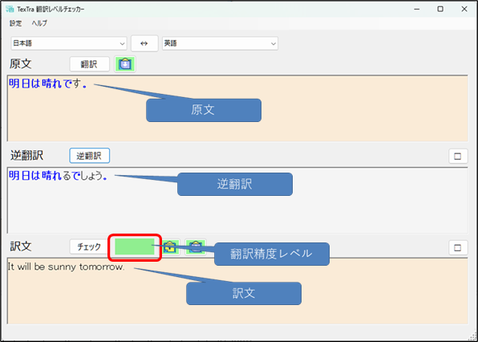
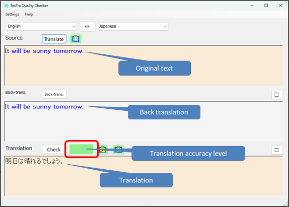

#  TexTra Quality Checker

<b>TexTra 翻訳レベルチェッカー</b>は 
原文に対する訳文の品質をチェックするアプリです。 
<b>訳文の信頼度</b>を３段階で表示します。 
  

<b>TexTra Quality Checker</b> is an application 
that evaluates the quality of a translated text against its original. 
The <b>translation accuracy</b> will be shown in three levels. 
  

------

## 📥インストール Install
TexTra Quality Checker.msiを 
本画面の「Releases」からダウンロードして実行してください。 
ttps://github.com/NICT-Dev/TexTra-Quality-Checker/releases＜予定＞ 

インストールが完了後、 
Windowsのメニューとデスクトップに 
アプリのアイコンが追加されます。 

ヘルプ 
https://nict-dev.github.io/TexTra-Quality-Checker/ja/メイン.html

................................................................................................................................................ 
Please download "TexTra Quality Checker.msi" 
from "Releases" section of this repository and run it. 
ttps://github.com/NICT-Dev/TexTra-Quality-Checker/releases = Upcoming Plans = 

After the installation is complete, 
the application icon will be added to the Windows Start menu and to the desktop. 

Help 
https://nict-dev.github.io/TexTra-Quality-Checker/en/メイン.html

------
##  みんなの自動翻訳 Min'na no Jido Hon'yaku

アプリ内では「みんなの自動翻訳」のアカウントが必要です。 
https://mt-auto-minhon-mlt.ucri.jgn-x.jp/

サーバーメンテナンスなどで 
一時的にご利用いただけないことがあります。 
サーバーメンテナンス情報などは下記をご確認ください。 
X(Twitter) 
https://twitter.com/minhonMT

................................................................................................................................................ 
A "Min'na no Jido Hon'yaku"  account to use the app. 
https://mt-auto-minhon-mlt.ucri.jgn-x.jp/

The service may be temporarily unavailable due to server maintenance.  
For server maintenance information, 
please check the details below. 
X(Twitter) 
https://twitter.com/minhonMT

------

## 💻 実行環境 System Requirements

64ビット版 Windows 10 または Windows 11 

Windows 10 (64‑bit) or Windows 11 (64‑bit) 

        